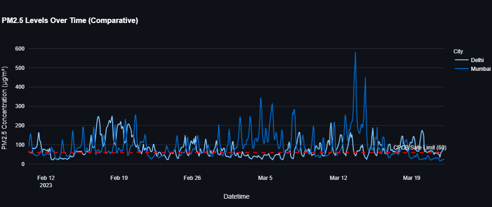
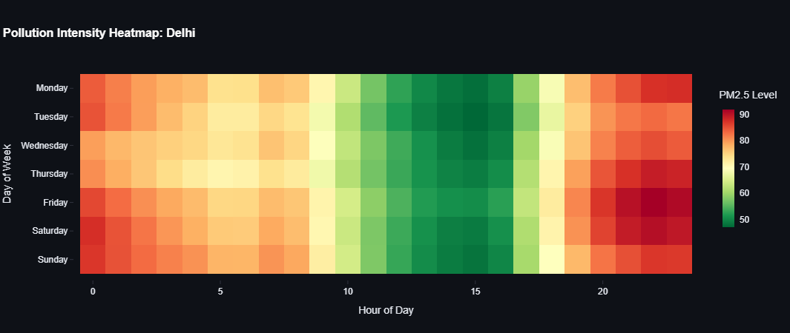
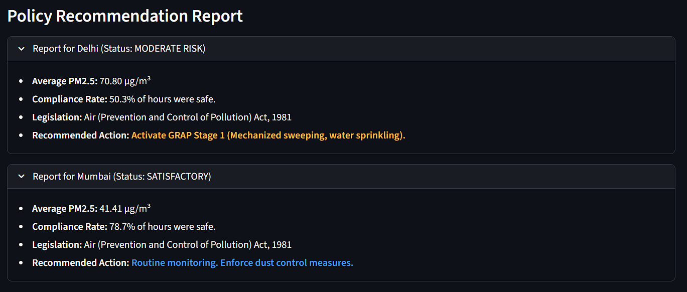

# Activity 3: Air & Noise Pollution Monitoring – Compliance Analytics Dashboard

---

## 1. Objective
To analyze authentic air pollution datasets (2022-2025) across Indian cities, assess compliance with environmental laws (Air Act, 1981), and visualize health impacts through an interactive Python-based dashboard.

## 2. Theory Linkage & Legislative Framework

### A. Environmental Legislation
* **The Air (Prevention and Control of Pollution) Act, 1981:** This act provides for the prevention, control, and abatement of air pollution. It empowers State Pollution Control Boards to enforce standards.
* **National Ambient Air Quality Standards (NAAQS):** Established by the CPCB, these standards set safe limits for pollutants (e.g., PM2.5 ≤ 60 µg/m³ for 24 hours).
* **Noise Pollution (Regulation and Control) Rules, 2000:** Regulates noise levels in industrial, commercial, and residential zones.

### B. Health Impacts
* **PM2.5 (Particulate Matter < 2.5 µm):** These fine particles penetrate deep into the lungs and enter the bloodstream, causing respiratory and cardiovascular diseases.
* **High AQI:** Prolonged exposure to "Poor" or "Severe" air quality is linked to reduced life expectancy and chronic obstructive pulmonary disease (COPD).

## 3. Methodology

### A. Dataset Identification
* **Source:** Authentic hourly air quality data (2022-2025) covering 29 major Indian cities.
* **Parameters:** PM2.5, PM10, NO2, SO2, CO, and meteorological factors (Wind Speed, Temperature).
* **Relevance:** The dataset allows for temporal analysis of pollution trends and compliance checking against CPCB standards.

### B. Technical Implementation
* **Tools Used:** Python (Pandas for data cleaning), Streamlit (for dashboard UI), Plotly (for interactive visualizations).
* **Preprocessing:** Missing values were imputed using median strategies. Data was resampled to daily averages for trend analysis.
* **Dashboard Features:** Multi-city comparison, temporal heatmaps, and automated policy recommendation engines.

---

## 4. Data Analysis & Dashboard Visualization

### Figure 1: Comparative Pollution Trends

**Analysis:**
The time-series analysis reveals significant seasonal variations. As seen in the graph, **Delhi** consistently exhibits spikes in PM2.5 levels during the winter months (November–January), often exceeding 250 µg/m³. This correlates with the "Winter Inversion" phenomenon where cold air traps pollutants near the ground.

### Figure 2: Temporal Heatmap (Peak Hour Analysis)

**Analysis:**
The heatmap visualization identifies critical pollution hotspots. Darker red zones are observed around **9:00 AM** and **8:00 PM**, indicating a strong correlation between vehicular traffic density and pollution spikes. This suggests that mobile sources are a primary contributor to urban air quality degradation.

### Figure 3: Compliance & Policy Recommendations

**Analysis:**
The dashboard automatically assesses compliance against the **Air Act, 1981**. For cities where the average PM2.5 exceeds 60 µg/m³, the system flags a "Non-Compliant" status. The automated logic suggests triggering the **Graded Response Action Plan (GRAP)**, such as banning construction activities or implementing traffic rationing, during severe episodes.

---

## 5. Government Initiatives & Organizations

### A. Central Pollution Control Board (CPCB)
The CPCB is the statutory organization under the Ministry of Environment, Forest and Climate Change. It runs the **National Air Quality Monitoring Programme (NAMP)** to determine the status and trends of ambient air quality.

### B. National Clean Air Programme (NCAP)
Launched in 2019, NCAP is a long-term, time-bound, national-level strategy to tackle the air pollution problem across the country in a comprehensive manner. The goal is to reduce particulate matter concentration by 20-30% in identified non-attainment cities.

---

## 6. Conclusion & Future Scope

### Conclusion
The analysis of the 2022-2025 dataset confirms that major Indian metropolitan areas face severe air quality challenges.
* **Data Findings:** A significant percentage of monitored hours violated the NAAQS limits.
* **Legislative Gap:** Despite the **Air Act, 1981**, enforcement remains a challenge during peak winter months.
* **Recommendation:** Immediate implementation of hyper-local monitoring and data-driven policy triggers (like those demonstrated in this dashboard) is essential for public health protection.

### Future Scope (AI/ML Application)
* **Predictive Modeling:** Implementing LSTM (Long Short-Term Memory) networks to forecast AQI 24 hours in advance.
* **Satellite Integration:** Combining ground sensor data with Aerosol Optical Depth (AOD) satellite imagery for better spatial coverage.

---
**References:**
1. Dataset: Indian Air Quality Data (2022-2025)
2. CPCB National Ambient Air Quality Standards (NAAQS)
3. The Air (Prevention and Control of Pollution) Act, 1981
